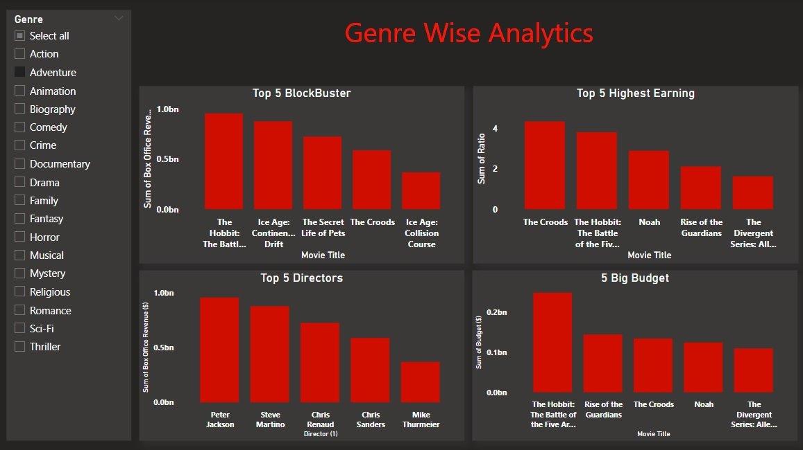
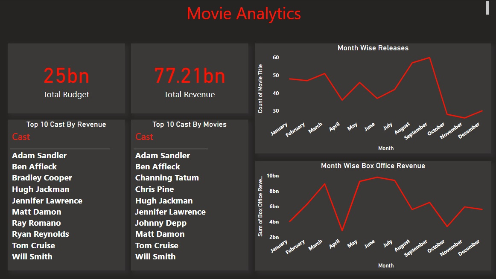
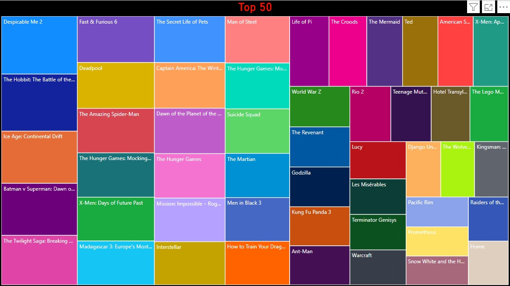

## Movie-Analysis
The Movie Analysis project aims to uncover insights from a movie dataset by examining attributes such as box office performance, genre popularity, ratings, and budgets. The analysis focuses on understanding trends and patterns to identify what factors contribute to a movie’s success.

## Key objectives:  
Identifying successful movie genres over time.  
Analyzing the relationship between budget and box office earnings.  
Exploring how ratings impact movie success.  
Discovering trends in movie performance based on director, runtime, and awards.  

The project involves data cleaning, descriptive statistics, and data visualization to provide actionable insights. An optional interactive dashboard will allow users to explore the data by filtering based on genre, year, director, and other factors.In the Movie Analysis project, tile charts are used to visualize trends and relationships between various movie attributes.

